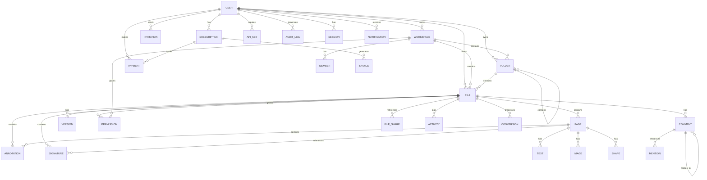

# Database Schema - PDFLeader Pro

## 🗄️ Database Design Overview

**Database**: PostgreSQL 15+  
**ORM**: Prisma  
**Approach**: Fully normalized with strategic denormalization for performance

## 📊 Entity Relationship Diagram



## 📋 Core Tables

### 1. USERS
Core user account information.

```sql
CREATE TABLE users (
    id UUID PRIMARY KEY DEFAULT gen_random_uuid(),
    email VARCHAR(255) UNIQUE NOT NULL,
    first_name VARCHAR(255),
    last_name VARCHAR(255),
    avatar_url TEXT,
    phone_number VARCHAR(20),
    password_hash VARCHAR(255), -- If using passwords (vs Clerk/Auth.js)
    preferred_language VARCHAR(10) DEFAULT 'en',
    timezone VARCHAR(50) DEFAULT 'UTC',
    is_email_verified BOOLEAN DEFAULT false,
    is_phone_verified BOOLEAN DEFAULT false,
    is_2fa_enabled BOOLEAN DEFAULT false,
    is_active BOOLEAN DEFAULT true,
    created_at TIMESTAMP DEFAULT CURRENT_TIMESTAMP,
    updated_at TIMESTAMP DEFAULT CURRENT_TIMESTAMP,
    last_login_at TIMESTAMP,
    deleted_at TIMESTAMP
);

CREATE INDEX idx_users_email ON users(email);
CREATE INDEX idx_users_created_at ON users(created_at DESC);
```

**Relationships**:
- Owns multiple files and folders
- Manages workspaces
- Has subscriptions
- Makes payments
- Creates API keys
- Generates audit logs

---

### 2. FILES
User-uploaded and managed PDF files.

```sql
CREATE TABLE files (
    id UUID PRIMARY KEY DEFAULT gen_random_uuid(),
    user_id UUID NOT NULL REFERENCES users(id) ON DELETE CASCADE,
    workspace_id UUID REFERENCES workspaces(id),
    folder_id UUID REFERENCES folders(id) ON DELETE SET NULL,
    
    name VARCHAR(500) NOT NULL,
    description TEXT,
    file_type VARCHAR(50) DEFAULT 'pdf', -- pdf, image, document
    mime_type VARCHAR(100),
    file_size BIGINT NOT NULL, -- in bytes
    storage_key VARCHAR(500) NOT NULL UNIQUE, -- S3/R2 key
    
    -- PDF Metadata
    page_count INTEGER,
    width FLOAT,
    height FLOAT,
    is_encrypted BOOLEAN DEFAULT false,
    is_locked BOOLEAN DEFAULT false,
    
    -- OCR & Indexing
    has_ocr BOOLEAN DEFAULT false,
    searchable_text TEXT, -- Full-text indexed
    language VARCHAR(10),
    
    -- Collaboration
    is_shared BOOLEAN DEFAULT false,
    share_url VARCHAR(255) UNIQUE,
    
    -- Versioning
    version_count INTEGER DEFAULT 1,
    current_version_id UUID,
    
    -- Status
    status VARCHAR(50) DEFAULT 'active', -- active, archived, deleted
    is_favorite BOOLEAN DEFAULT false,
    is_public BOOLEAN DEFAULT false,
    
    -- Metadata
    tags TEXT[] DEFAULT ARRAY[]::TEXT[],
    properties JSONB, -- Custom metadata
    
    -- Timestamps
    created_at TIMESTAMP DEFAULT CURRENT_TIMESTAMP,
    updated_at TIMESTAMP DEFAULT CURRENT_TIMESTAMP,
    last_accessed_at TIMESTAMP,
    last_edited_at TIMESTAMP,
    deleted_at TIMESTAMP
);

CREATE INDEX idx_files_user_id ON files(user_id);
CREATE INDEX idx_files_workspace_id ON files(workspace_id);
CREATE INDEX idx_files_folder_id ON files(folder_id);
CREATE INDEX idx_files_created_at ON files(created_at DESC);
CREATE INDEX idx_files_status ON files(status);
CREATE INDEX idx_files_is_favorite ON files(is_favorite);
CREATE INDEX idx_files_searchable_text ON files USING GIN(to_tsvector('english', searchable_text));
```

**Relationships**:
- Owned by one user
- Belongs to one workspace
- Belongs to one folder
- Contains multiple pages
- Has multiple versions
- Has multiple comments
- Contains multiple annotations
- Has permission records

---

### 3. PAGES
Individual pages within a PDF file.

```sql
CREATE TABLE pages (
    id UUID PRIMARY KEY DEFAULT gen_random_uuid(),
    file_id UUID NOT NULL REFERENCES files(id) ON DELETE CASCADE,
    
    page_number INTEGER NOT NULL,
    
    -- Page Content
    width FLOAT NOT NULL,
    height FLOAT NOT NULL,
    rotation INTEGER DEFAULT 0, -- 0, 90, 180, 270
    
    -- Rendering
    thumbnail_key VARCHAR(500), -- S3/R2 key for thumbnail
    content_json JSONB, -- Page content structure
    
    -- Metadata
    created_at TIMESTAMP DEFAULT CURRENT_TIMESTAMP,
    updated_at TIMESTAMP DEFAULT CURRENT_TIMESTAMP
);

CREATE INDEX idx_pages_file_id ON pages(file_id);
CREATE INDEX idx_pages_page_number ON pages(file_id, page_number);
```

**Relationships**:
- Belongs to one file
- Contains multiple annotations
- Contains multiple text elements
- Contains multiple images
- Contains multiple shapes

---

### 4. ANNOTATIONS
Editable annotations (text, shapes, drawings, etc.)

```sql
CREATE TABLE annotations (
    id UUID PRIMARY KEY DEFAULT gen_random_uuid(),
    file_id UUID NOT NULL REFERENCES files(id) ON DELETE CASCADE,
    page_id UUID NOT NULL REFERENCES pages(id) ON DELETE CASCADE,
    created_by UUID NOT NULL REFERENCES users(id) ON DELETE CASCADE,
    
    -- Type of annotation
    type VARCHAR(50) NOT NULL, -- text, shape, drawing, highlight, comment, signature
    sub_type VARCHAR(50), -- For shapes: rectangle, circle, arrow, line, etc.
    
    -- Position and size
    x FLOAT NOT NULL,
    y FLOAT NOT NULL,
    width FLOAT NOT NULL,
    height FLOAT NOT NULL,
    rotation FLOAT DEFAULT 0,
    
    -- Content
    content TEXT, -- For text annotations
    content_json JSONB, -- For complex content
    
    -- Styling
    color VARCHAR(9) DEFAULT '#000000', -- Hex color
    background_color VARCHAR(9),
    border_width FLOAT DEFAULT 1,
    border_style VARCHAR(50), -- solid, dashed, dotted
    fill_opacity FLOAT DEFAULT 1,
    
    -- Text specific
    font_family VARCHAR(100),
    font_size INTEGER,
    font_weight VARCHAR(20), -- normal, bold
    text_align VARCHAR(20), -- left, center, right
    
    -- Drawing/Path specific
    stroke_style JSONB, -- Path smoothing, pressure points
    
    -- Visibility
    is_locked BOOLEAN DEFAULT false,
    z_index INTEGER DEFAULT 0, -- Layer order
    is_deleted BOOLEAN DEFAULT false,
    
    -- Versioning
    version INTEGER DEFAULT 1,
    
    -- Metadata
    created_at TIMESTAMP DEFAULT CURRENT_TIMESTAMP,
    updated_at TIMESTAMP DEFAULT CURRENT_TIMESTAMP
);

CREATE INDEX idx_annotations_file_id ON annotations(file_id);
CREATE INDEX idx_annotations_page_id ON annotations(page_id);
CREATE INDEX idx_annotations_created_by ON annotations(created_by);
CREATE INDEX idx_annotations_type ON annotations(type);
```

**Relationships**:
- Belongs to one file
- Belongs to one page
- Created by one user
- Can have comments

---

### 5. COMMENTS & REPLIES
Collaboration comments system.

```sql
CREATE TABLE comments (
    id UUID PRIMARY KEY DEFAULT gen_random_uuid(),
    file_id UUID NOT NULL REFERENCES files(id) ON DELETE CASCADE,
    annotation_id UUID REFERENCES annotations(id) ON DELETE SET NULL,
    created_by UUID NOT NULL REFERENCES users(id) ON DELETE SET NULL,
    
    -- Thread management
    parent_comment_id UUID REFERENCES comments(id) ON DELETE CASCADE,
    
    -- Content
    content TEXT NOT NULL,
    
    -- Mentions
    mentions UUID[] DEFAULT ARRAY[]::UUID[], -- mentioned user IDs
    
    -- Status
    is_resolved BOOLEAN DEFAULT false,
    resolved_at TIMESTAMP,
    resolved_by UUID REFERENCES users(id),
    
    -- Metadata
    created_at TIMESTAMP DEFAULT CURRENT_TIMESTAMP,
    updated_at TIMESTAMP DEFAULT CURRENT_TIMESTAMP
);

CREATE INDEX idx_comments_file_id ON comments(file_id);
CREATE INDEX idx_comments_annotation_id ON comments(annotation_id);
CREATE INDEX idx_comments_created_by ON comments(created_by);
CREATE INDEX idx_comments_parent_comment_id ON comments(parent_comment_id);
```

---

### 6. SIGNATURES
User signature management and tracking.

```sql
CREATE TABLE signatures (
    id UUID PRIMARY KEY DEFAULT gen_random_uuid(),
    user_id UUID NOT NULL REFERENCES users(id) ON DELETE CASCADE,
    file_id UUID REFERENCES files(id),
    page_id UUID REFERENCES pages(id),
    
    -- Signature details
    type VARCHAR(50) NOT NULL, -- drawn, uploaded, typed
    name VARCHAR(255), -- Display name
    signature_data TEXT NOT NULL, -- Base64 or SVG
    
    -- Positioning
    x FLOAT,
    y FLOAT,
    width FLOAT,
    height FLOAT,
    rotation FLOAT DEFAULT 0,
    
    -- Verification
    certificate_id VARCHAR(255), -- Digital cert reference
    timestamp TIMESTAMP DEFAULT CURRENT_TIMESTAMP,
    ip_address INET,
    user_agent TEXT,
    
    -- Status
    is_initial BOOLEAN DEFAULT false,
    is_archived BOOLEAN DEFAULT false,
    
    -- Metadata
    created_at TIMESTAMP DEFAULT CURRENT_TIMESTAMP,
    updated_at TIMESTAMP DEFAULT CURRENT_TIMESTAMP
);

CREATE INDEX idx_signatures_user_id ON signatures(user_id);
CREATE INDEX idx_signatures_file_id ON signatures(file_id);
```

---

### 7. WORKSPACES
Multi-tenant workspace management.

```sql
CREATE TABLE workspaces (
    id UUID PRIMARY KEY DEFAULT gen_random_uuid(),
    owner_id UUID NOT NULL REFERENCES users(id) ON DELETE CASCADE,
    
    name VARCHAR(255) NOT NULL,
    description TEXT,
    avatar_url TEXT,
    
    -- Storage settings
    max_storage_bytes BIGINT DEFAULT 107374182400, -- 100GB default
    current_storage_bytes BIGINT DEFAULT 0,
    
    -- Collaboration settings
    allow_invites BOOLEAN DEFAULT true,
    allow_public_sharing BOOLEAN DEFAULT true,
    require_password_for_shares BOOLEAN DEFAULT false,
    
    -- Status
    is_active BOOLEAN DEFAULT true,
    
    -- Metadata
    created_at TIMESTAMP DEFAULT CURRENT_TIMESTAMP,
    updated_at TIMESTAMP DEFAULT CURRENT_TIMESTAMP
);

CREATE INDEX idx_workspaces_owner_id ON workspaces(owner_id);
```

---

### 8. FOLDERS
File organization with nesting.

```sql
CREATE TABLE folders (
    id UUID PRIMARY KEY DEFAULT gen_random_uuid(),
    workspace_id UUID NOT NULL REFERENCES workspaces(id) ON DELETE CASCADE,
    user_id UUID NOT NULL REFERENCES users(id) ON DELETE CASCADE,
    
    name VARCHAR(255) NOT NULL,
    parent_folder_id UUID REFERENCES folders(id) ON DELETE CASCADE,
    
    -- Metadata
    created_at TIMESTAMP DEFAULT CURRENT_TIMESTAMP,
    updated_at TIMESTAMP DEFAULT CURRENT_TIMESTAMP,
    
    UNIQUE(workspace_id, parent_folder_id, name)
);

CREATE INDEX idx_folders_workspace_id ON folders(workspace_id);
CREATE INDEX idx_folders_user_id ON folders(user_id);
CREATE INDEX idx_folders_parent_folder_id ON folders(parent_folder_id);
```

---

### 9. PERMISSIONS
Role-based access control.

```sql
CREATE TABLE permissions (
    id UUID PRIMARY KEY DEFAULT gen_random_uuid(),
    file_id UUID NOT NULL REFERENCES files(id) ON DELETE CASCADE,
    
    user_id UUID REFERENCES users(id) ON DELETE CASCADE,
    -- For public links, user_id is NULL
    
    role VARCHAR(50) NOT NULL, -- owner, editor, viewer, commenter
    -- owner: Full control
    -- editor: Can edit, annotate, share
    -- commenter: Can only add comments
    -- viewer: Read-only
    
    -- Expiration
    expires_at TIMESTAMP,
    
    -- Metadata
    created_at TIMESTAMP DEFAULT CURRENT_TIMESTAMP,
    updated_at TIMESTAMP DEFAULT CURRENT_TIMESTAMP
);

CREATE INDEX idx_permissions_file_id ON permissions(file_id);
CREATE INDEX idx_permissions_user_id ON permissions(user_id);
```

---

### 10. FILE_VERSIONS
Version history and rollback capability.

```sql
CREATE TABLE file_versions (
    id UUID PRIMARY KEY DEFAULT gen_random_uuid(),
    file_id UUID NOT NULL REFERENCES files(id) ON DELETE CASCADE,
    created_by UUID NOT NULL REFERENCES users(id) ON DELETE SET NULL,
    
    version_number INTEGER NOT NULL,
    
    -- Version content
    storage_key VARCHAR(500) NOT NULL, -- S3/R2 key
    file_size BIGINT NOT NULL,
    
    -- Change tracking
    change_summary TEXT, -- Description of changes
    
    -- Timestamps
    created_at TIMESTAMP DEFAULT CURRENT_TIMESTAMP,
    
    UNIQUE(file_id, version_number)
);

CREATE INDEX idx_file_versions_file_id ON file_versions(file_id);
```

---

### 11. SUBSCRIPTIONS
User subscription plans and billing.

```sql
CREATE TABLE subscriptions (
    id UUID PRIMARY KEY DEFAULT gen_random_uuid(),
    user_id UUID NOT NULL UNIQUE REFERENCES users(id) ON DELETE CASCADE,
    
    -- Plan info
    plan_type VARCHAR(50) NOT NULL, -- free, starter, pro, business, enterprise
    stripe_subscription_id VARCHAR(255) UNIQUE,
    stripe_customer_id VARCHAR(255),
    
    -- Limits
    max_files INTEGER,
    max_storage_bytes BIGINT,
    max_file_size BIGINT,
    max_users INTEGER, -- For team plans
    
    -- Status
    status VARCHAR(50) DEFAULT 'active', -- active, cancelled, suspended, expired
    current_period_start TIMESTAMP,
    current_period_end TIMESTAMP,
    
    -- Metadata
    created_at TIMESTAMP DEFAULT CURRENT_TIMESTAMP,
    updated_at TIMESTAMP DEFAULT CURRENT_TIMESTAMP,
    cancelled_at TIMESTAMP
);

CREATE INDEX idx_subscriptions_user_id ON subscriptions(user_id);
CREATE INDEX idx_subscriptions_stripe_customer_id ON subscriptions(stripe_customer_id);
```

---

### 12. PAYMENTS & INVOICES
Payment tracking and billing history.

```sql
CREATE TABLE payments (
    id UUID PRIMARY KEY DEFAULT gen_random_uuid(),
    subscription_id UUID NOT NULL REFERENCES subscriptions(id),
    user_id UUID NOT NULL REFERENCES users(id) ON DELETE CASCADE,
    
    -- Payment details
    stripe_payment_intent_id VARCHAR(255) UNIQUE,
    amount_cents INTEGER NOT NULL, -- In cents for precision
    currency VARCHAR(3) DEFAULT 'USD',
    status VARCHAR(50) DEFAULT 'pending', -- pending, succeeded, failed, cancelled
    
    -- Metadata
    created_at TIMESTAMP DEFAULT CURRENT_TIMESTAMP,
    updated_at TIMESTAMP DEFAULT CURRENT_TIMESTAMP
);

CREATE TABLE invoices (
    id UUID PRIMARY KEY DEFAULT gen_random_uuid(),
    subscription_id UUID NOT NULL REFERENCES subscriptions(id),
    user_id UUID NOT NULL REFERENCES users(id) ON DELETE CASCADE,
    
    -- Invoice details
    stripe_invoice_id VARCHAR(255) UNIQUE,
    invoice_number VARCHAR(50) UNIQUE,
    amount_cents INTEGER NOT NULL,
    currency VARCHAR(3) DEFAULT 'USD',
    status VARCHAR(50) DEFAULT 'draft', -- draft, sent, viewed, paid, uncollectible
    
    -- Dates
    issue_date TIMESTAMP DEFAULT CURRENT_TIMESTAMP,
    due_date TIMESTAMP,
    paid_at TIMESTAMP,
    
    -- Metadata
    created_at TIMESTAMP DEFAULT CURRENT_TIMESTAMP,
    updated_at TIMESTAMP DEFAULT CURRENT_TIMESTAMP
);

CREATE INDEX idx_payments_user_id ON payments(user_id);
CREATE INDEX idx_payments_status ON payments(status);
CREATE INDEX idx_invoices_user_id ON invoices(user_id);
```

---

### 13. AUDIT_LOGS
Comprehensive activity tracking for security and compliance.

```sql
CREATE TABLE audit_logs (
    id UUID PRIMARY KEY DEFAULT gen_random_uuid(),
    user_id UUID REFERENCES users(id) ON DELETE SET NULL,
    file_id UUID REFERENCES files(id) ON DELETE SET NULL,
    
    -- Event tracking
    event_type VARCHAR(100) NOT NULL, -- user.login, file.created, annotation.added, etc.
    action VARCHAR(50) NOT NULL, -- create, read, update, delete
    resource_type VARCHAR(50), -- file, annotation, user, etc.
    
    -- Details
    changes JSONB, -- Before/after values
    description TEXT,
    
    -- Request context
    ip_address INET,
    user_agent TEXT,
    
    -- Compliance
    is_sensitive BOOLEAN DEFAULT false,
    requires_approval BOOLEAN DEFAULT false,
    
    -- Timestamps
    created_at TIMESTAMP DEFAULT CURRENT_TIMESTAMP
);

CREATE INDEX idx_audit_logs_user_id ON audit_logs(user_id);
CREATE INDEX idx_audit_logs_file_id ON audit_logs(file_id);
CREATE INDEX idx_audit_logs_event_type ON audit_logs(event_type);
CREATE INDEX idx_audit_logs_created_at ON audit_logs(created_at DESC);
```

---

### 14. SESSIONS
User session management.

```sql
CREATE TABLE sessions (
    id UUID PRIMARY KEY DEFAULT gen_random_uuid(),
    user_id UUID NOT NULL REFERENCES users(id) ON DELETE CASCADE,
    
    -- Session details
    token_hash VARCHAR(255) UNIQUE NOT NULL,
    refresh_token_hash VARCHAR(255) UNIQUE,
    
    -- Device info
    device_name VARCHAR(255),
    device_type VARCHAR(50), -- desktop, mobile, tablet
    browser VARCHAR(100),
    os VARCHAR(100),
    
    -- Location
    ip_address INET,
    country VARCHAR(100),
    city VARCHAR(100),
    
    -- Expiry
    expires_at TIMESTAMP NOT NULL,
    last_activity_at TIMESTAMP DEFAULT CURRENT_TIMESTAMP,
    
    -- Status
    is_active BOOLEAN DEFAULT true,
    is_revoked BOOLEAN DEFAULT false,
    
    -- Metadata
    created_at TIMESTAMP DEFAULT CURRENT_TIMESTAMP
);

CREATE INDEX idx_sessions_user_id ON sessions(user_id);
CREATE INDEX idx_sessions_token_hash ON sessions(token_hash);
CREATE INDEX idx_sessions_expires_at ON sessions(expires_at);
```

---

### 15. NOTIFICATIONS
Real-time notification system.

```sql
CREATE TABLE notifications (
    id UUID PRIMARY KEY DEFAULT gen_random_uuid(),
    user_id UUID NOT NULL REFERENCES users(id) ON DELETE CASCADE,
    
    -- Notification details
    type VARCHAR(50) NOT NULL, -- comment.mention, file.shared, signature.requested, etc.
    title VARCHAR(255) NOT NULL,
    message TEXT,
    action_url VARCHAR(500),
    
    -- Related data
    related_user_id UUID REFERENCES users(id) ON DELETE SET NULL,
    related_file_id UUID REFERENCES files(id) ON DELETE SET NULL,
    
    -- Status
    is_read BOOLEAN DEFAULT false,
    read_at TIMESTAMP,
    
    -- Metadata
    created_at TIMESTAMP DEFAULT CURRENT_TIMESTAMP
);

CREATE INDEX idx_notifications_user_id ON notifications(user_id);
CREATE INDEX idx_notifications_is_read ON notifications(user_id, is_read);
```

---

### 16. ACTIVITY_LOG
Real-time activity tracking for dashboards.

```sql
CREATE TABLE activity_log (
    id UUID PRIMARY KEY DEFAULT gen_random_uuid(),
    user_id UUID NOT NULL REFERENCES users(id) ON DELETE CASCADE,
    file_id UUID REFERENCES files(id) ON DELETE CASCADE,
    
    -- Activity details
    activity_type VARCHAR(50) NOT NULL, -- upload, edit, comment, share, download, etc.
    description TEXT,
    
    -- Metadata
    metadata JSONB,
    
    created_at TIMESTAMP DEFAULT CURRENT_TIMESTAMP
);

CREATE INDEX idx_activity_log_user_id ON activity_log(user_id, created_at DESC);
CREATE INDEX idx_activity_log_file_id ON activity_log(file_id, created_at DESC);
```

---

### 17. API_KEYS
External API access for integrations.

```sql
CREATE TABLE api_keys (
    id UUID PRIMARY KEY DEFAULT gen_random_uuid(),
    user_id UUID NOT NULL REFERENCES users(id) ON DELETE CASCADE,
    
    name VARCHAR(255) NOT NULL,
    key_hash VARCHAR(255) UNIQUE NOT NULL, -- Never store plain keys
    
    -- Permissions
    scopes TEXT[] DEFAULT ARRAY['read']::TEXT[],
    
    -- Status
    is_active BOOLEAN DEFAULT true,
    last_used_at TIMESTAMP,
    
    -- Expiry
    expires_at TIMESTAMP,
    
    -- Metadata
    created_at TIMESTAMP DEFAULT CURRENT_TIMESTAMP
);

CREATE INDEX idx_api_keys_user_id ON api_keys(user_id);
```

---

## 🔄 Relationships Summary

| From | To | Type | Cascade |
|------|-----|------|---------|
| Users | Files | 1-to-Many | DELETE CASCADE |
| Users | Workspaces | 1-to-Many | DELETE CASCADE |
| Files | Pages | 1-to-Many | DELETE CASCADE |
| Files | Annotations | 1-to-Many | DELETE CASCADE |
| Files | Permissions | 1-to-Many | DELETE CASCADE |
| Files | Comments | 1-to-Many | DELETE CASCADE |
| Pages | Annotations | 1-to-Many | DELETE CASCADE |
| Comments | Comments | 1-to-Many (Self) | DELETE CASCADE |
| Users | Sessions | 1-to-Many | DELETE CASCADE |
| Users | Subscriptions | 1-to-1 | DELETE CASCADE |

---

## 📈 Performance Considerations

### Indexes
- **B-tree indexes** on foreign keys
- **GIN indexes** for full-text search
- **Composite indexes** on frequently filtered columns
- **Partial indexes** for status filtering

### Query Patterns
```sql
-- Most common: Files by user
SELECT * FROM files WHERE user_id = $1 ORDER BY created_at DESC LIMIT 50;

-- Recent activity
SELECT * FROM activity_log WHERE user_id = $1 ORDER BY created_at DESC LIMIT 100;

-- File collaboration
SELECT * FROM permissions WHERE file_id = $1;

-- Full-text search
SELECT * FROM files 
WHERE searchable_text @@ plainto_tsquery('english', $1)
AND user_id = $2
ORDER BY created_at DESC;
```

### Connection Pooling
- **PgBouncer** or **Prisma client** manages connections
- **Min pool size**: 5
- **Max pool size**: 20
- **Connection timeout**: 10 seconds

---

## 🔐 Security Practices

1. **No sensitive data in logs** - Use audit logging instead
2. **Encryption at rest** - For sensitive file content
3. **Field-level encryption** - For payment info
4. **Audit trails** - Complete history of changes
5. **Access controls** - Role-based permissions
6. **Data retention** - Comply with regulations

---

## 📊 Denormalization Points

Strategic denormalization for performance:

1. **files.page_count** - Cached from pages table
2. **files.current_storage_bytes** - Updated on file changes
3. **workspaces.current_storage_bytes** - Sum of all files
4. **subscriptions.stripe_customer_id** - For quick lookups

Maintained via database triggers and background jobs.

---

**Next Phase**: Project structure, configuration, and design system.
